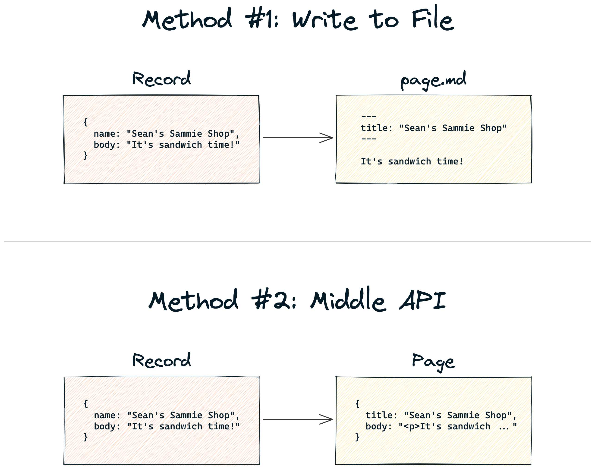
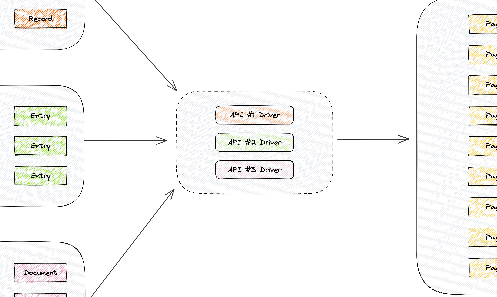

build-lists: true

# Shaping Data to Fuel a Front-End Engine

### Sean C Davis

---

---

[.header: #FFFFFF, Source Serif Pro, alignment(center)]

# But today, I am ...

---

[.header: #FFFFFF, Source Serif Pro, alignment(center)]

# Front End Advocate

---

[.header: #FFFFFF, Source Serif Pro, alignment(center)]

# Our **front ends** are **shaped** by the **APIs** (back ends) they use.

---

[.text: Source Code Pro, alignment(center)]

[.column]

 

Space

Environment

Content Model

Entry

Field

[.column]

 

Project

Dataset

Document Type

Document

Field

---

---

[.header: #FFFFFF, DM Serif Display, alignment(center), text-scale(1.25)]

# In a perfect world ...

---

---

### _Introducing_ ...

# The Middle!

---

### ( _Nope._ )

---

### _Or ..._

# Middle End?

---

### _Or ..._

# Middle Middle?

---

### _Or ..._

# Middle Layer?

---

### ( _Help!_ )

---

[.header: #FFFFFF, DM Serif Display, alignment(center)]
[.text: #FFFFFF, Source Serif Pro]

# How _The Middle Layer_ Works

1. Retrieves data from API (back end)
1. Transforms and normalizes data
1. Makes data available to the front end

---

[.header: #FFFFFF, DM Serif Display, alignment(center), text-scale(1.25)]

### Two Methods of

# Implementation

---

---

[.header: #FFFFFF, Source Serif Pro, alignment(center)]

# In an **abstracted state**, you can add **"drivers"** (plugins) to support **multiple APIs**.

---

---

[.header: #FFFFFF, DM Serif Display, alignment(center)]
[.text: #FFFFFF, Source Serif Pro]

# Two Primary Benefits

1. Front and back can do their own thing.
1. Front ends can be built consistently regardless of the source.

---

