theme: Sean C Davis
build-lists: true


# Balancing<br>_Flexibility_ & _Productivity_<br>in Content Modeling

### Sean C Davis

---


---


# I ❤️ sandwiches and stories.

^ Let me tell you a story. (We'll talk about sandwiches a bit, too. But later.)

---


---


[.header: #FFFFFF, alignment(left), DM Serif Display, text-scale(1.25)]

# It begins

## with a sad story.

---


[.header: #FFFFFF, DM Serif Display, text-scale(1.25)]

# [fit] _Everyone_

## [fit] hates their CMS.

---


[.header: #FFFFFF, DM Serif Display]

# [fit] And just when all seems lost ...

---


[.header: #FFFFFF, DM Serif Display, text-scale(1.25)]

# [fit] We find a way ...

^ I'm going to show you how to make people love it. (Or hate it less.)

---


[.header: #FFFFFF, DM Serif Display, text-scale(1.25)]

# [fit] ... to love our CMS again!

---


[.header: #FFFFFF, DM Serif Display, text-scale(1.25)]

# [fit] THE END

---

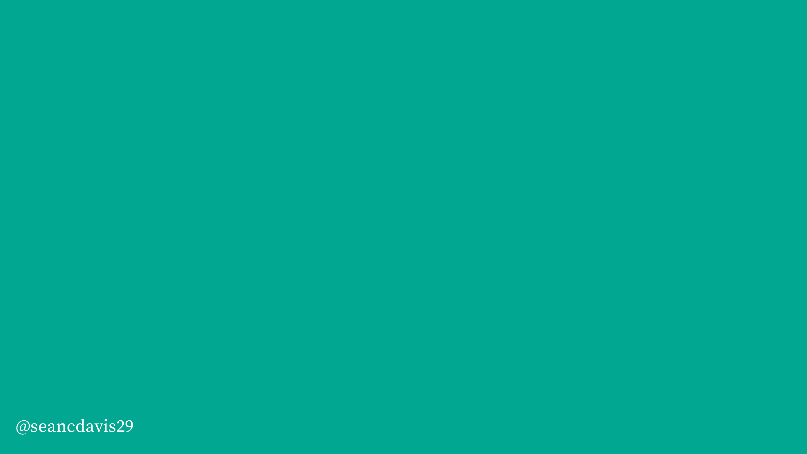

[.header: #FFFFFF, Source Serif Pro, alignment(center)]

# We're going to focus on<br>**the JavaScript CMS**.

---


# Not These

### _(Classic Site Builders)_

<br>


<br>


---


# These

### _(Modern & Headless)_

<br>


<br>


---


[.header: #000000, Source Serif Pro, alignment(center)]

# The modern CMS puts<br>**developers first**.<br>It's _our_ responsibility<br>to **design an experience**<br>our editors will find _effective_.

---


[.header: #FFFFFF, Source Serif Pro, alignment(center)]

# I believe we can find a<br>**_balanced_ approach**<br>that makes **developers**<br>_and_ **content editors** happy.

^
Sticking with theory because there are so many options.

---


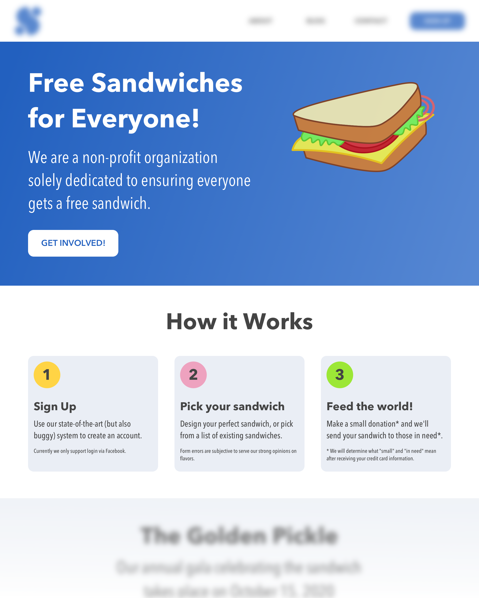

[.header: alignment(right), Source Serif Pro]

### [Example]

# Let's build a<br>**CMS experience** for this design.

# Then we'll write the<br>**front end** code.

---

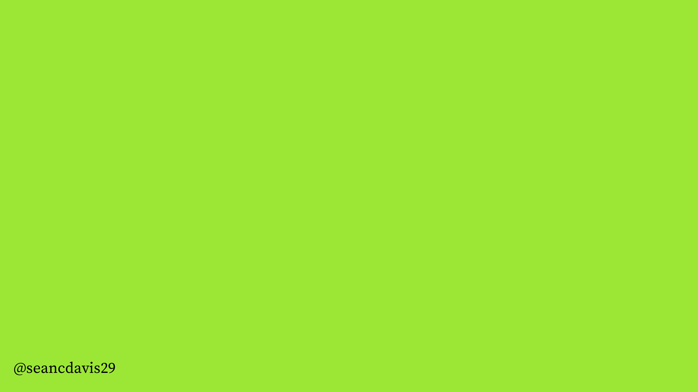

[.header: #000000, Source Serif Pro, alignment(center)]

### Example:

# sandwichshare.vercel.app

### (Next.js + TypeScript + Forestry)

---

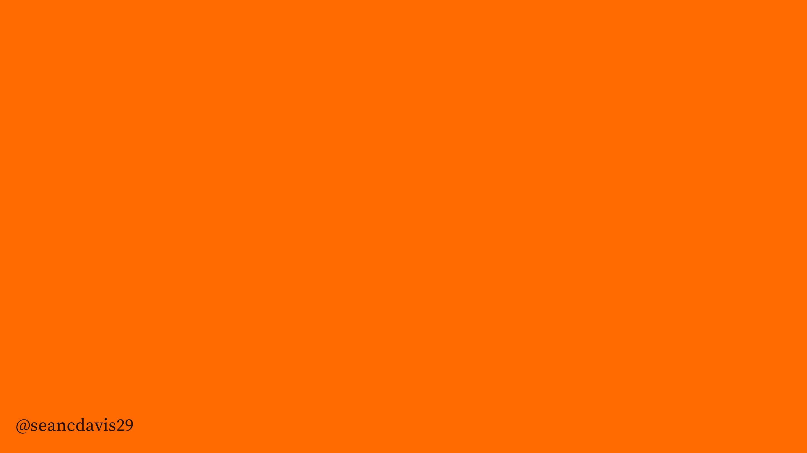

[.header: #261000, Source Serif Pro, alignment(center)]

# The two extremes of<br>**content modeling** ...

^ How would you model<br>the content for that page?

---

# Ultimate Flexibility


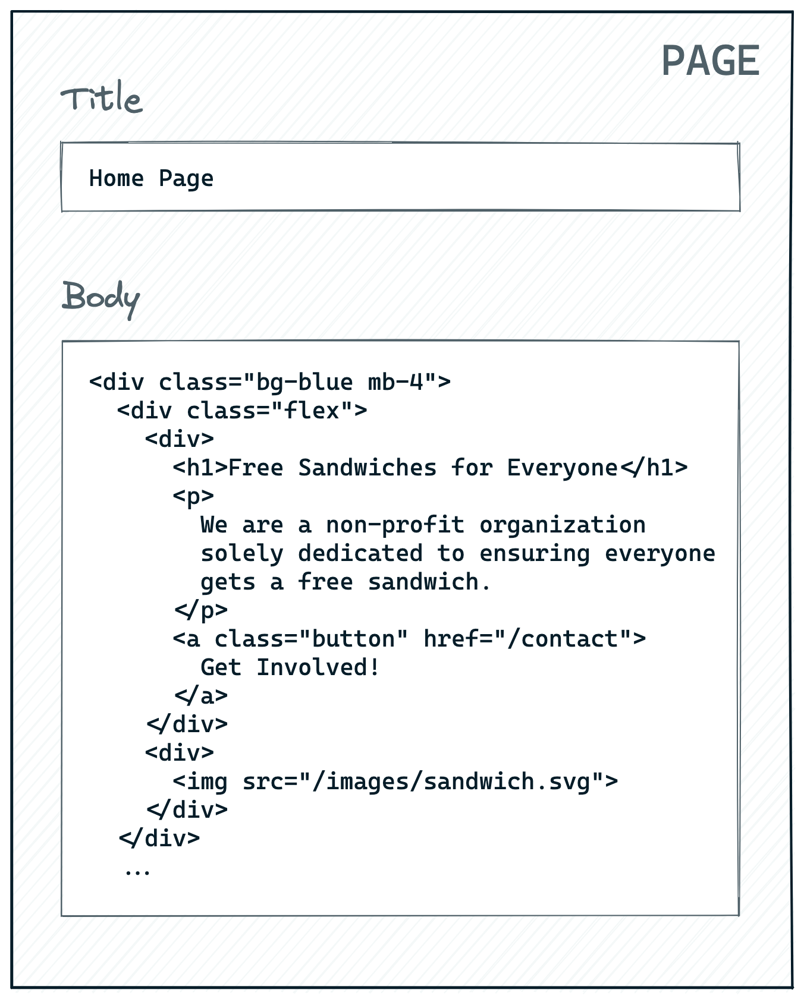


---

# Ultimate Flexibility


^ Like a sandwich you make in your own kitchen. You can do whatever you want. But you have to decide and you have to do the work. Like peanut butter and mayonnaise, Grandma White.

^ When you choose **flexibility**, your content editors can **do whatever they want**, but it **requires technical knowledge** and (usually) **isn't productive**.

---

## Ultimate Productivity


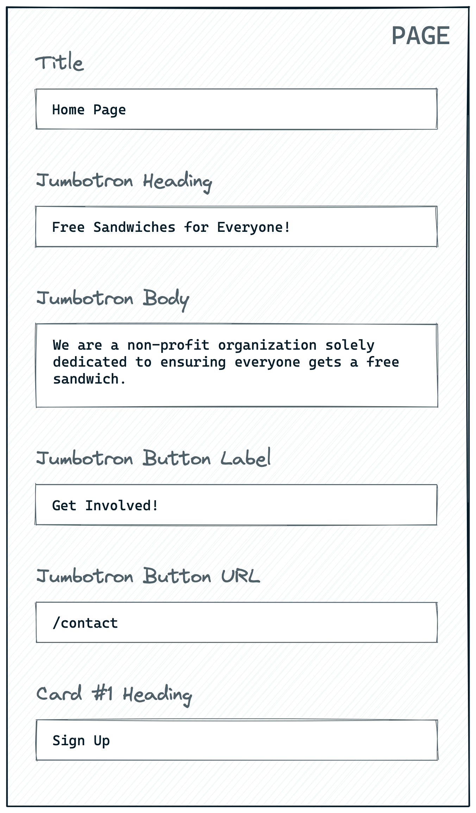


^ Maybe a graphic with the CMS experience. Or maybe just excalidraw.

---

## Ultimate Productivity


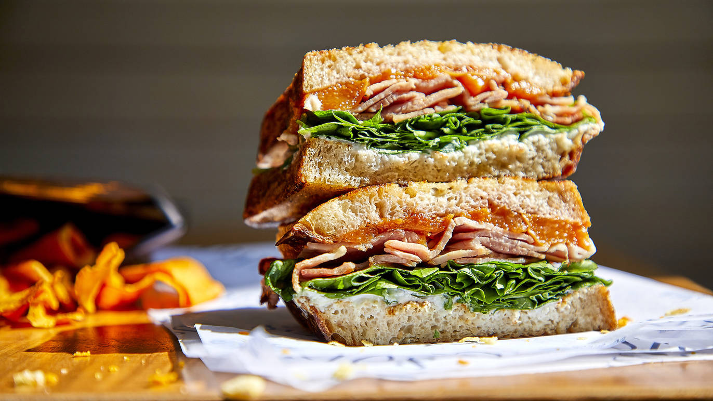


^ Like a sandwich you buy in a deli. I have this local deli that has dozens of options, but it names every ingredient that will go on the sandwich ahead of time. Like a reuben. I say "Reuben" and I know what to expect.

^ When you choose **productivity**, content editors can **move fast**, but they are stuck to a **specific implementation**.

---


[.header: #000000, Source Serif Pro, alignment(center)]

# [fit] The key is to find<br>the perfect **balance** of<br>**flexibility** and **productivity**.

^ We know we want to find a balance in here, but how do we do that?

---


[.header: #FFFFFF, Source Serif Pro, alignment(center)]

# We can find that balance by<br>combining **ultimate flexibility**<br>with **_modern_ best practices**,<br>then add **_customized_ rigidity**.

---


[.header: #FFFFFF, Source Serif Pro, alignment(center)]

# Two (of many) **best practices** when building websites today ...

---


# [fit] 1. Use a Component-Based Framework

<br>


<br>


^ We build websites with components these days (server or client) to reduce duplicated code. Thinking of a website in terms of a global system makes it easier to add and edit over time.

---


# [fit] 2. Separate Content from Presentation


^ Separating content from presentation (no need to have a cms with _ultimate_ flexibility. that's what code is for)

---


[.header: #051C28, Source Serif Pro, alignment(center)]

# Apply those _principles_ to **the CMS**.

^ How do those practices translate to the CMS?

---


[.header: #261000, Source Serif Pro, alignment(center)]

### _Best Practice #1_

# Break our home page up into **_reusable_ components**.

---

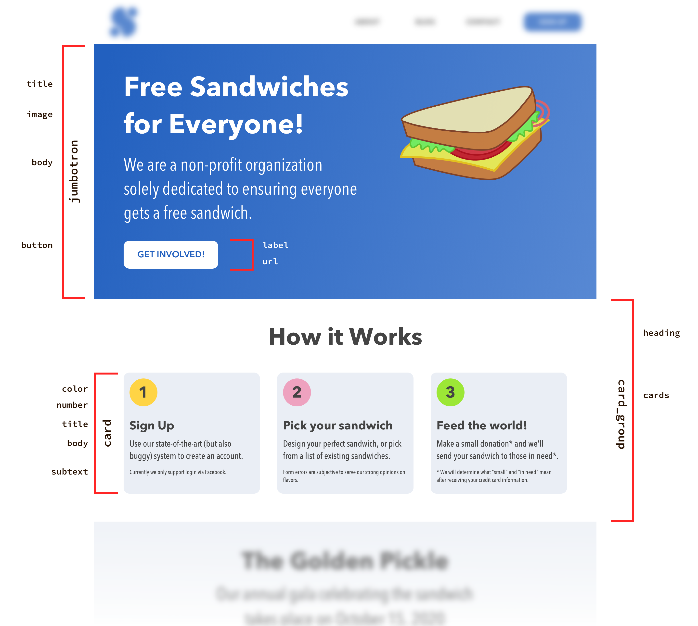

---


[.header: #000000, Source Serif Pro, alignment(center)]

### _Best Practice #2_

# **Separate the content** on the page from the code that powers it.

---


```json
{
  "title": "Home Page",
  "components": [
    {
      "type": "jumbotron",
      "title": "Free Sandwiches for Everyone!",
      "body": "We are a non-profit organization ...",
      "image": "sandwich.svg",
      "button": { "label": "Get Involved!", "url": "/contact" }
    },
    {
      "type": "card_group",
      "heading": "How it Works",
      "cards": [
        { "type": "card", "color": "yellow", "number": "1" /* ... */ }
        // ...
      ]
    }
  ]
}
```

---

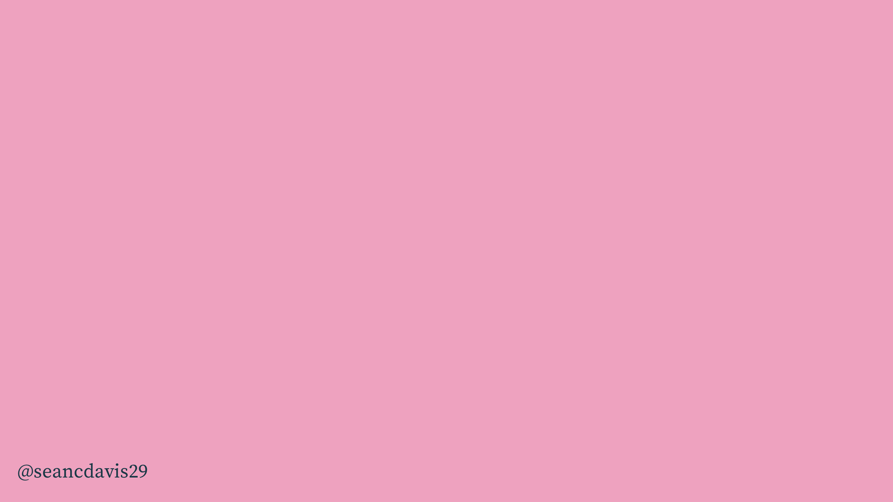

[.header: #1B3846, Source Serif Pro, alignment(center)]

# There are<br>**two common approaches**<br>to modeling<br>**component-driven pages**<br>in a CMS.

^ Modeling affects cost many times.

---


#### _Option #1_

## [fit] Associated<br>Component Records

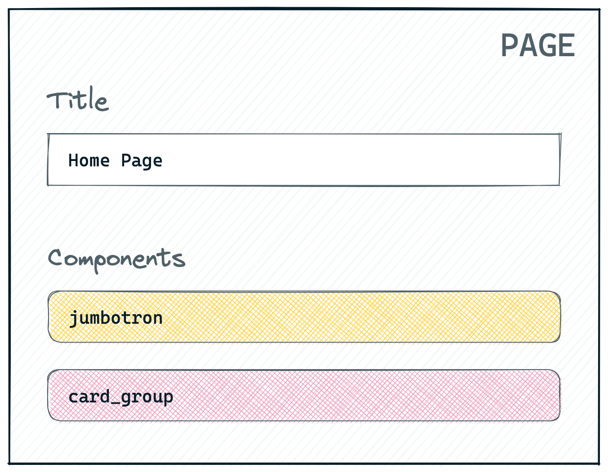

---


---


#### _Option #2_

## [fit] Embedded<br>Component Fields

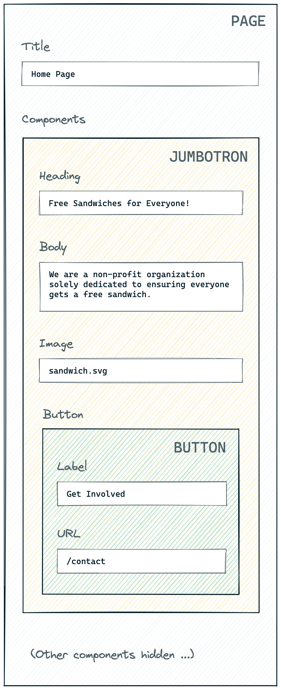

---

[.build-lists: false]


# Comparing the Options

[.column]

### Associated Records

- Reusability
- Pricing tier limitations
- Unlimited nestable layers

[.column]

### Embedded Fields

- Works well with git-based CMS
- All page content in one place
- Lower cost
- CMS limitations

---


# CMS Hack: Conditional Fields

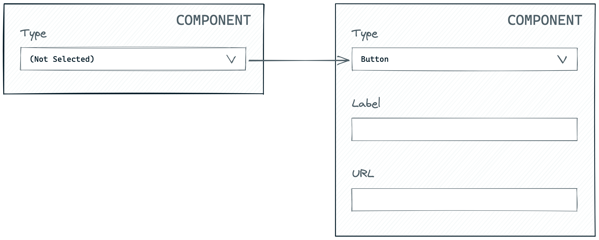

^ Which CMS does this well?

^ I think ... remove this one and focus on storing content as whether it should be attached to the page or associated with it. And that it usually is a result of 1) CMS capabilities, and 2) cost (cost is often associated with number of records or models)

^ Or ... maybe this is an option that comes after as its own sort of thing. As a way to get around cost. Technically conditional fields could be used with either method (embedded or associated), but it's not a great practice if it can be avoided.

---


[.header: #FFFFFF, Source Serif Pro, alignment(center)]

# With a _flexible_ page model in place, we can **build the front end**, maintaining _parity_ with **the CMS**.

---


# Simple Data Flow


---


# Expanded Data Flow

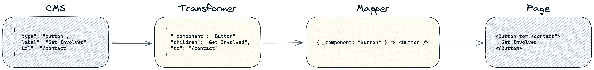

---


# Expanded Data Flow

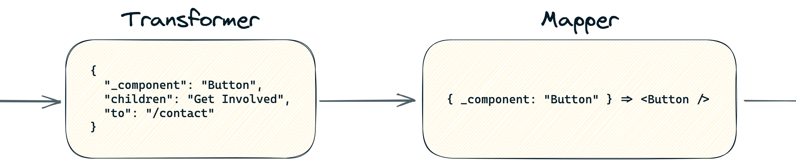

---


### _An Example_

## Page API Response

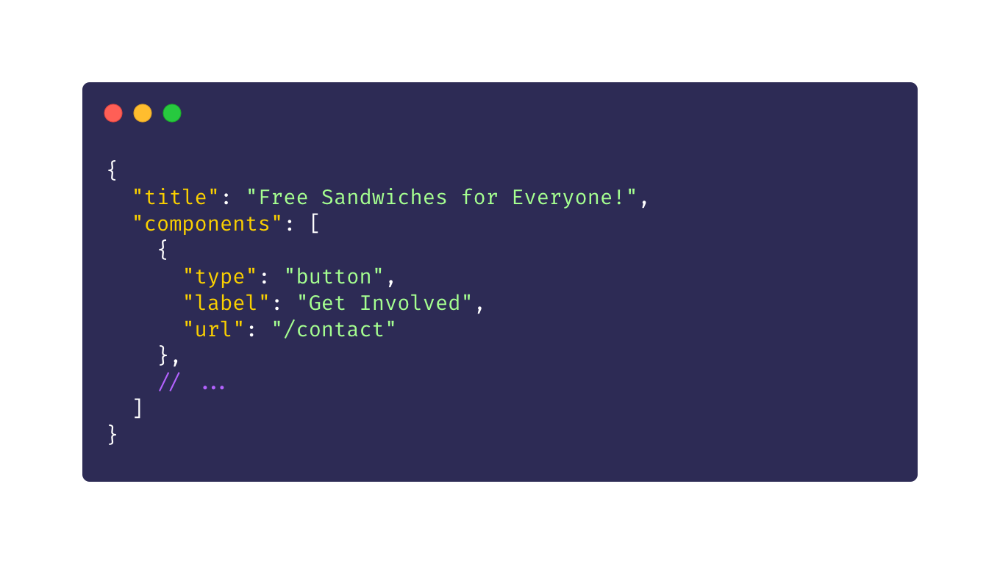

---


[.header: #261000, Source Serif Pro, alignment(center)]

# _Transformers_ enable us to take data from any source and **shape it** for our **components**.

---


# Button Transformer

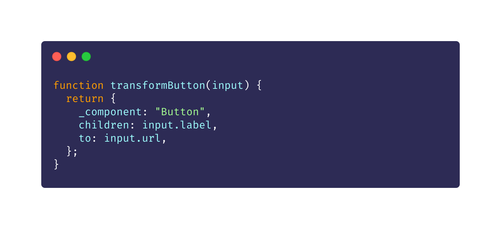

---


[.header: #000000, Source Serif Pro, alignment(center)]

# _Mappers_ enable a _page_ to **dynamically render components** based on data from the **CMS**.

---


# Button Mapper

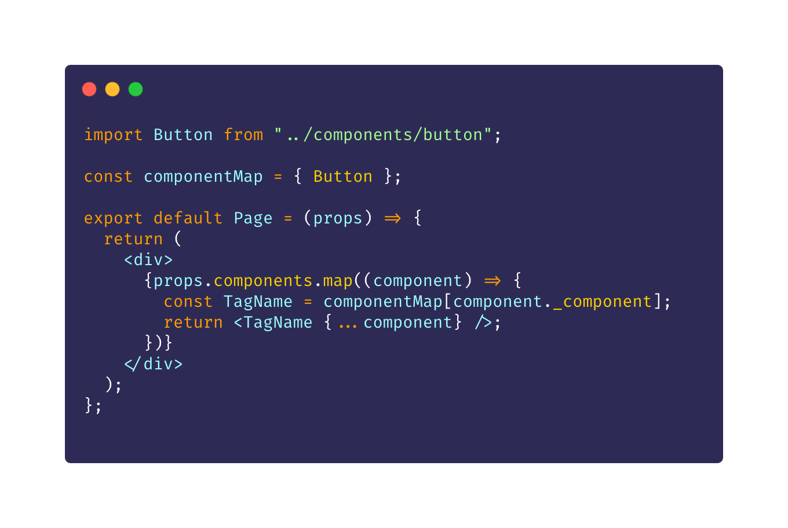

---


[.header: #1B3846, Source Serif Pro, alignment(center)]

# Using _transformers_ and _mappers_,<br>you can build<br>**the ultimately flexible page**<br>on the front end.

---


[.header: #051C28, Source Serif Pro, alignment(center)]

# The **flexible page model** is a<br>**solid base**, but it's not (_usually_) the _most productive_ for **content editors**.

---


[.header: #FFFFFF, Source Serif Pro, alignment(center)]

# _Templates_, built on top of the **flexible page**, help us create **efficient and repeatable patterns**.

^ Create new page type or model with repeatable patterns. Think: blog posts, generic content pages, etc.

---


[.header: alignment(right), Source Serif Pro]

## Create _templates_<br>(or _page types_) to provide **efficiency** to **content editors**.

## Use **component-based fields** to add **flexibility** only where necessary.

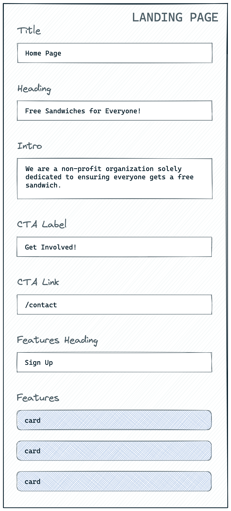

^ Templates streamline the flexible page by introducing _some_ amount of rigidity (i.e. productivity)

---


[.header: alignment(right), Source Serif Pro]

### Putting the code together is **simple** because your **components** are already in place.

### Your template is just a<br>**custom mapping** of<br>**specific fields** to **components**.

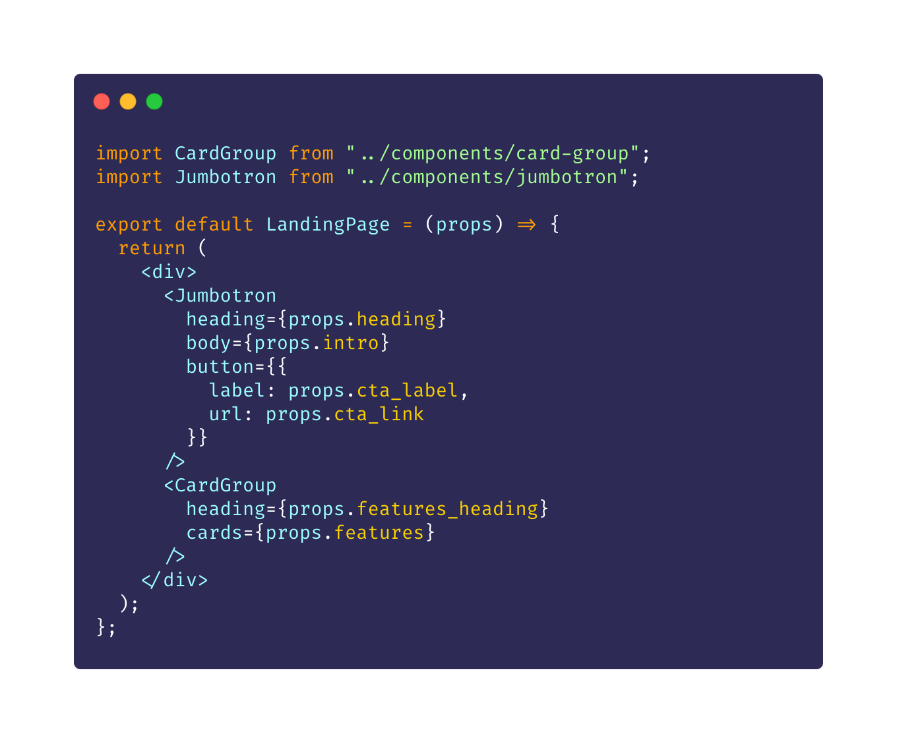

^ Also gives you the ability to make it easier to add specific styling to some template (exceptions to global patterns).

---


[.header: Source Serif Pro, alignment(center)]

# There are **two major benefits** to using **templates** ...

---


[.header: #FFFFFF, Source Serif Pro, alignment(center)]

# (1) _Templates_ enable you to<br>**decrease complexity** and<br>**increase productivity**<br>to _perfectly align_ with the<br>**editors' technical abilities**.

---


[.header: #261000, Source Serif Pro, alignment(center)]

# (2) You now have a<br>**base engine** in place.

# A **powerful starting point**<br>for **every project**.

^ All you have to do is define the components and decide where you want to introduce templates to help your editors, because templates in the code are still built on top of the flexible page.

---


# [tldr]

1. Start with a **flexible base** that **pulls data** from the CMS, **transforms** it, then **maps** it to **front end components**.
1. Use **templates** to **decrease complexity** and **increase productivity** for your editors.
1. **Cost** and **CMS editing experience** are directly related to how you **model content**. Choose the **best approach** for each project independently.

---

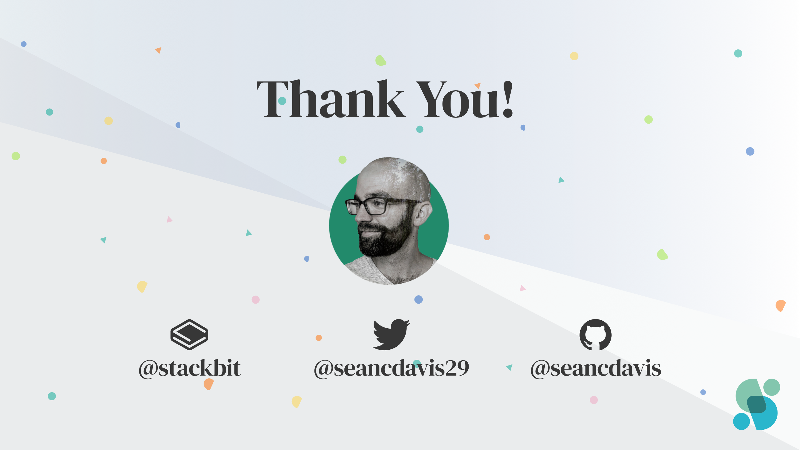
