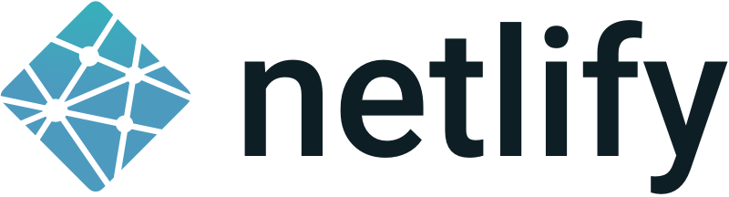

theme: Sean C Davis

# Settling Down in a Jamstack World

### Sean C Davis

---

### [Work] _Ample_ Director of Technology

#### [Web] seancdavis.com

#### [Twitter] @seancdavis29

---

# The Old Way

---

# The Jamstack Way

[.column]

[.column]

---

# You get to choose the best tool for each job!

---

---

[.header: #FFFFFF, text-scale(1.3), Source Serif Pro]

# How do you **settle down** in a **Jamstack world** without **becoming obsolete?**

---

[.header: #FFFFFF, alignment(left), text-scale(1.3), DM Serif Display]
[.text: #FFFFFF, Source Serif Pro]
[.link: #FFFFFF, Source Serif Pro, underline(thick)]

## 1) Create a starting point.

- Decide on your preferred set of tools and services.
- Create a _kit_ with those tools ready to go. (e.g. [@ample/gatsby-starter-ample](https://github.com/ample/gatsby-starter-ample))

---

[.header: #FFFFFF, alignment(left), text-scale(1.3), DM Serif Display]
[.text: #FFFFFF, Source Serif Pro]
[.link: #FFFFFF, Source Serif Pro, underline(thick)]

## 2) Work consistently.

[.column]

- Create and document processes. (e.g. [@ample/dev-playbook](https://github.com/ample/dev-playbook))
- Build tooling to support your go-to tools. (e.g. [gatsby-remark-ample](https://github.com/ample/gatsby-starter-ample/tree/main/plugins/gatsby-remark-ample))
- Share every update with your team. _Over_ share. (e.g. _Dev Code Share_)

---

[.header: #FFFFFF, alignment(left), text-scale(1.3), DM Serif Display]
[.text: #FFFFFF, Source Serif Pro]

## 3) Maintain curiosity.

- Set aside time for research and development. (e.g. _80% allocation_)
- Question current toolset. Be able to answer, "Why?" (e.g. _Dev Lab_)
- Make adjustments in small doses. (e.g. _One Thing Rule_)

---

[.header: #FFFFFF, text-scale(1.3), Source Serif Pro]

# But, most importantly ...

---

[.header: #FFFFFF, text-scale(1.3), Source Serif Pro]

# Don't forget to **have a little fun** along the way.

---

[.header: #FFFFFF, alignment(left), text-scale(1.3), DM Serif Display]
[.text: #FFFFFF, Source Serif Pro, alignment(center)]

# Wrapping up ...

### 1) Create a starting point.

### 2) Work consistently.

### 3) Maintain curiosity.

  And don't forget to **have a little fun** along the way.

---

# Thank You

### Sean C Davis

#### seancdavis.com | @seancdavis29
