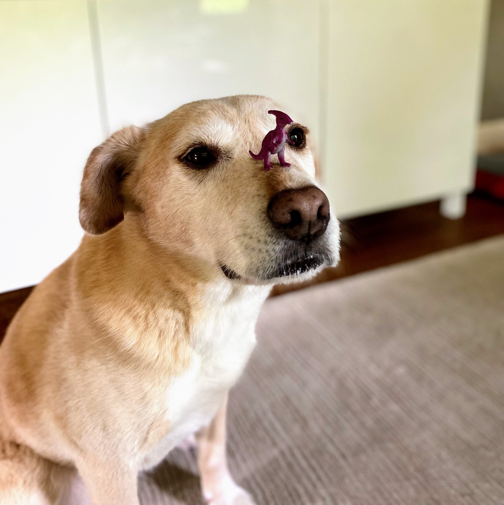
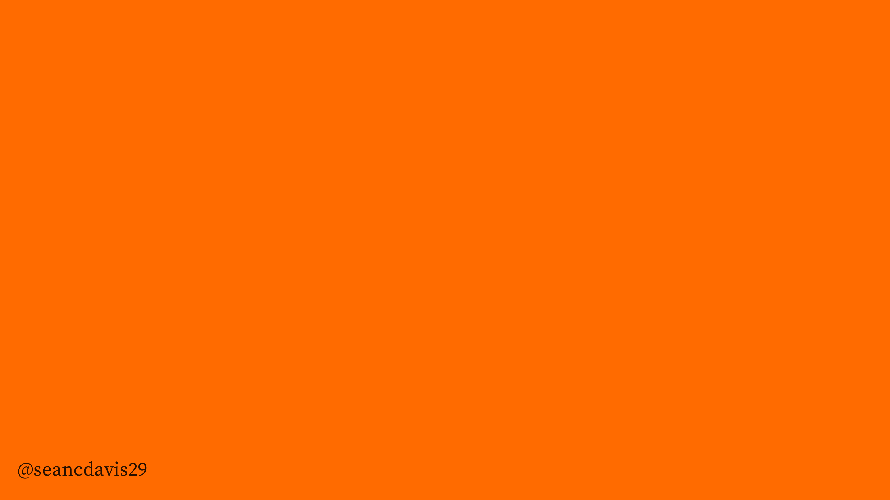
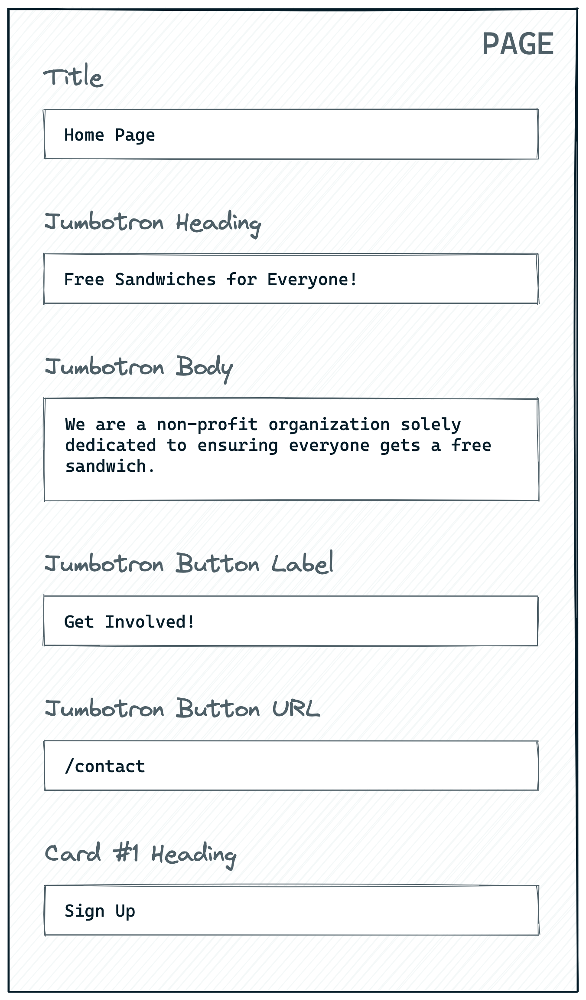
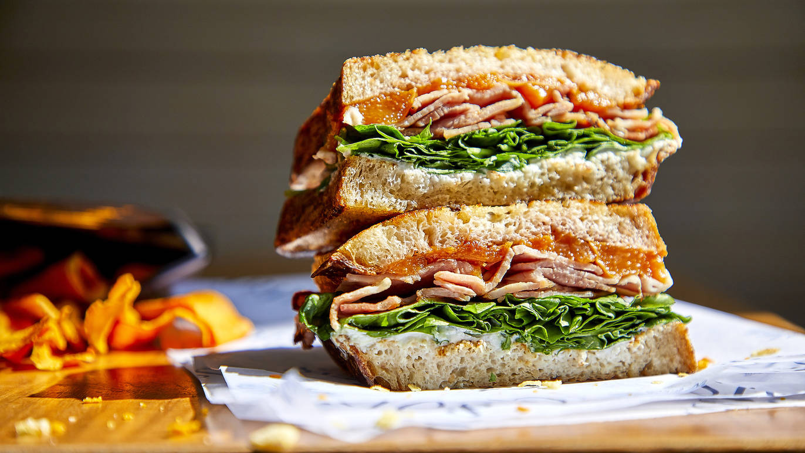
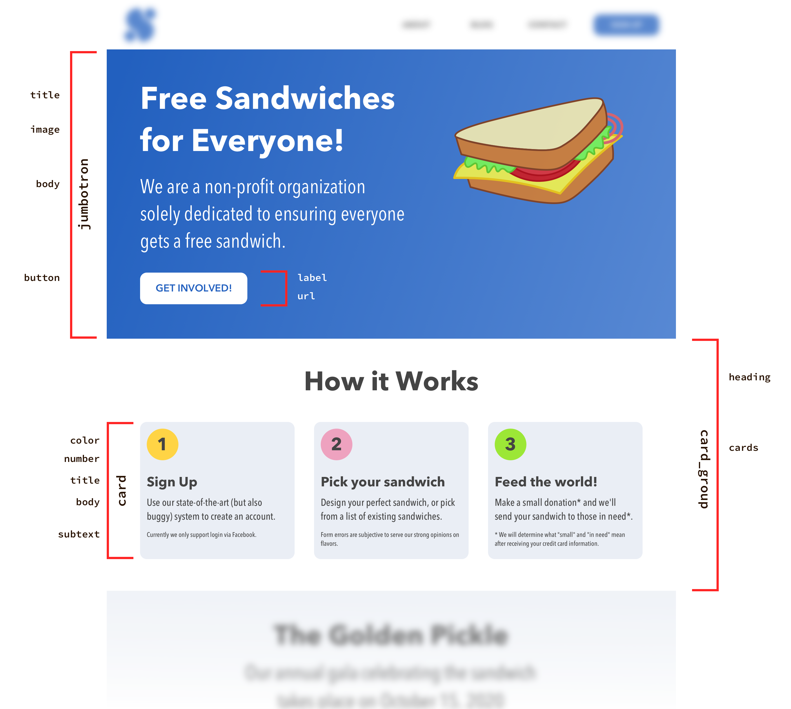
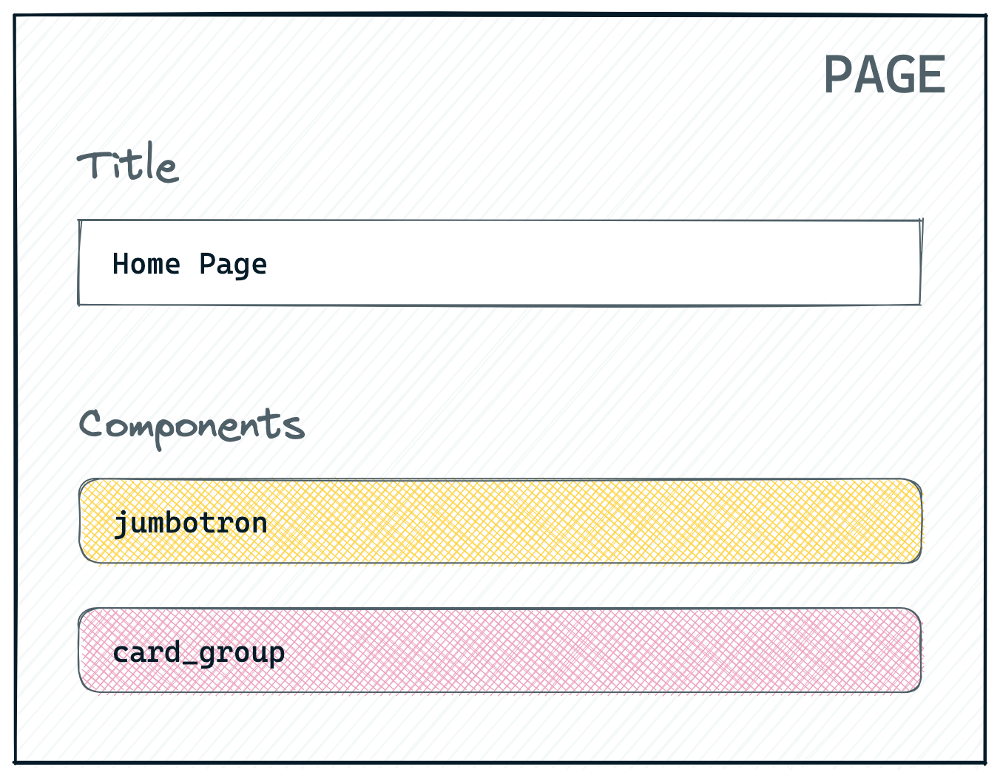
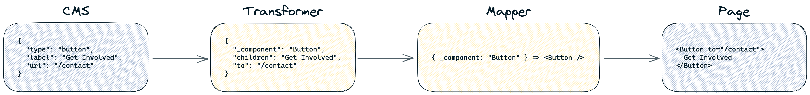
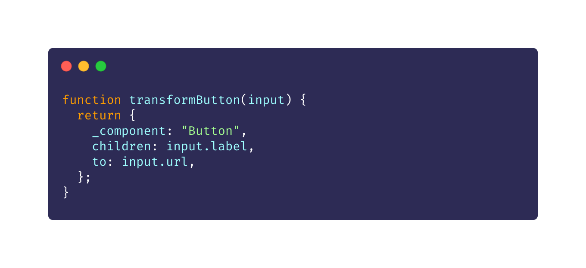
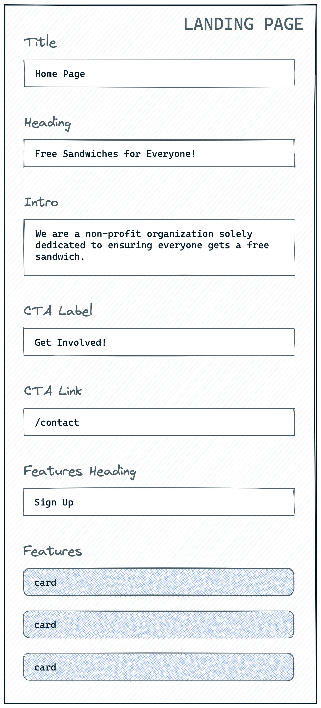
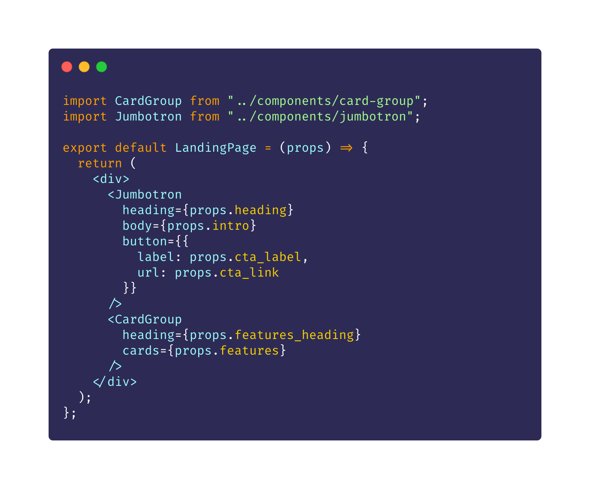

theme: Sean C Davis
build-lists: true


# Balancing<br>_Flexibility_ & _Productivity_<br>in Content Modeling

### Sean C Davis

---


---


[.header: #FFFFFF, alignment(left), DM Serif Display, text-scale(1.25)]

# It begins

## with a sad story.

---


[.header: #FFFFFF, DM Serif Display, text-scale(1.25)]

# [fit] _Everyone_

## [fit] hates their CMS.

---


[.header: #FFFFFF, DM Serif Display]

# [fit] And just when all seems lost ...

---


[.header: #FFFFFF, DM Serif Display, text-scale(1.25)]

# [fit] We find a way ...

^ I'm going to show you how to make people love it. (Or hate it less.)

---


[.header: #FFFFFF, DM Serif Display, text-scale(1.25)]

# [fit] ... to love our CMS again!

---


[.header: #FFFFFF, DM Serif Display, text-scale(1.25)]

# [fit] THE END

---


[.text-emphasis: DM Serif Display]
[.header: #FFFFFF, alignment(left), DM Serif Display, text-scale(1.5)]

### ~~Pause!~~

# Paws!

---


^ Three things about me ...

---

# [fit] C

---


[.header: alignment(left), Source Serif Pro]



## This is **Stella**.

## She balances objects on her nose.

## She gets rewarded handsomely for her efforts.

---


# I ❤️ sandwiches and stories.

^ Let me tell you a story. (We'll talk about sandwiches a bit, too. But later.)

---


[.text: alignment(center), Source Serif Pro]

# Spot the Sandwich!

There is a hidden sandwich somewhere
in the coming slides.

When you find it, **tweet a screenshot**
that **mentions @seancdavis29**.

First correct answer wins
some super cool Stackbit swag!

---


[.header: #FFFFFF, Source Serif Pro, alignment(center)]

# There are **three types** of<br>content management systems,<br>distinguished by how the _front end_ **consumes content**.

---


# 1. Monolithic CMS

### _(Direct Database Access)_

<br>


<br>


---


# 2. Decoupled/Headless CMS

### _(API-Driven)_

<br>


<br>


---


# 3. Git-Based CMS

### _(Embedded Files)_

<br>


<br>


---

[.build-lists: false]


# Benefits Over Monolithic CMS

[.column]

## Decoupled

- Front-end flexibility
- Future-proof
- Omnichannel
- Scalable

[.column]

## Git-Based

- Cost
- Scalable
- Developer experience
- Ownership

---


[.header: alignment(left), Source Serif Pro]

# With<br>**great power**<br>comes<br>**great _headaches_**.


^ headless cms empowers developers, but with great power comes great responsibility

---


[.header: alignment(right), Source Serif Pro]

# _Like ..._<br>**managing cost**.

# _Or ..._<br>building a<br>**content schema** from scratch.

^
As powerful as this pattern is, it brings along challenges with it.

---


[.header: #FFFFFF, Source Serif Pro, alignment(center)]

# I believe we can find a<br>**_balanced_ approach**<br>that makes **developers**<br>_and_ **content editors** happy.

^
Sticking with theory because there are so many options.

---


[.header: #051C28, Source Serif Pro, alignment(center)]

# Let's start by making our<br>**content editors** happy.

---


[.header: alignment(right), Source Serif Pro]

# Let's build a<br>**CMS experience** for this design.

# Then we'll write the<br>**front end** code.

---



[.header: #261000, Source Serif Pro, alignment(center)]

# The two extremes of<br>**content modeling** ...

^ How would you model<br>the content for that page?

---

# Ultimate Flexibility


---

# Ultimate Flexibility


^ Like a sandwich you make in your own kitchen. You can do whatever you want. But you have to decide and you have to do the work. Like peanut butter and mayonnaise, Grandma White.

---


[.header: #000000, Source Serif Pro, alignment(center)]

# When you choose **flexibility**,<br>your content editors can<br>**do whatever they want**, but it **requires technical knowledge** and (usually) **isn't productive**.

---

## Ultimate Productivity





^ Maybe a graphic with the CMS experience. Or maybe just excalidraw.

---

## Ultimate Productivity





^ Like a sandwich you buy in a deli. I have this local deli that has dozens of options, but it names every ingredient that will go on the sandwich ahead of time. Like a reuben. I say "Reuben" and I know what to expect.

---


[.header: #1B3846, Source Serif Pro, alignment(center)]

# When you choose **productivity**, content editors can **move fast**,<br>but they are stuck to a<br>**specific implementation**.

---


[.header: #000000, Source Serif Pro, alignment(center)]

# [fit] The key is to find<br>the perfect **balance** of<br>**flexibility** and **productivity**.

^ We know we want to find a balance in here, but how do we do that?

---


[.header: #FFFFFF, Source Serif Pro, alignment(center)]

# Now we can make<br>our developers happy!

### (Finally.)

^ The coolest people ever. Our rockstars. Overselling it?

---


[.header: #FFFFFF, Source Serif Pro, alignment(center)]

# Two (of many) **best practices** when building websites today ...

---


# [fit] 1. Use a Component-Based Framework

<br>


<br>


^ We build websites with components these days (server or client) to reduce duplicated code. Thinking of a website in terms of a global system makes it easier to add and edit over time.

---


# [fit] 2. Separate Content from Presentation


^ Separating content from presentation (no need to have a cms with _ultimate_ flexibility. that's what code is for)

---


[.header: #051C28, Source Serif Pro, alignment(center)]

# We can apply those same<br>principles to our CMS.

^ How do those practices translate to the CMS?

---


[.header: #261000, Source Serif Pro, alignment(center)]

# Let's break our home page up into **_reusable_ components**.

---



---


[.header: #000000, Source Serif Pro, alignment(center)]

# How might we **extract the content** so that we can **deliver** it to the code?

---


```json
{
  "title": "Home Page",
  "components": [
    {
      "type": "jumbotron",
      "title": "Free Sandwiches for Everyone!",
      "body": "We are a non-profit organization ...",
      "image": "sandwich.svg",
      "button": { "label": "Get Involved!", "url": "/contact" }
    },
    {
      "type": "card_group",
      "heading": "How it Works",
      "cards": [
        { "type": "card", "color": "yellow", "number": "1" /* ... */ }
        // ...
      ]
    }
  ]
}
```

---


[.header: #1B3846, Source Serif Pro, alignment(center)]

# How do we apply<br>**the ultimately flexible page** to **content modeling** in a **CMS**?

^ Modeling affects cost many times.

---


#### _Option #1_

## [fit] Associated<br>Component Records



---


---


#### _Option #2_

## [fit] Embedded<br>Component Fields


---

[.build-lists: false]


# Comparing the Options

[.column]

### Associated Records

- Reusability
- Pricing tier limitations
- Unlimited nestable layers

[.column]

### Embedded Fields

- Works well with git-based CMS
- All page content in one place
- Lower cost
- CMS limitations

---


[.header: #FFFFFF, Source Serif Pro, alignment(center)]

# The **cost** and **editing experience** are _directly tied_ to how you choose to **model content**.

---


# CMS Hack: Conditional Fields


^ Which CMS does this well?

^ I think ... remove this one and focus on storing content as whether it should be attached to the page or associated with it. And that it usually is a result of 1) CMS capabilities, and 2) cost (cost is often associated with number of records or models)

^ Or ... maybe this is an option that comes after as its own sort of thing. As a way to get around cost. Technically conditional fields could be used with either method (embedded or associated), but it's not a great practice if it can be avoided.

---


[.header: #FFFFFF, Source Serif Pro, alignment(center)]

# With a _flexible_ page model in place, we can **build the front end**, maintaining _parity_ with **the CMS**.

---


# Simple Data Flow


---


# Expanded Data Flow



---


# Expanded Data Flow


---


### _An Example_

## Page API Response


---


[.header: #261000, Source Serif Pro, alignment(center)]

# _Transformers_ enable us to take data from any source and **shape it** for our **components**.

---


# Button Transformer



---


[.header: #000000, Source Serif Pro, alignment(center)]

# _Mappers_ enable a _page_ to **dynamically render components** based on data from the **CMS**.

---


# Button Mapper


---


[.header: #1B3846, Source Serif Pro, alignment(center)]

# Using _transformers_ and _mappers_, you can build **the ultimately flexible page** on the front end.

---


[.header: alignment(right), Source Serif Pro, text-scale(1.25)]

# 🥪 **_Hooray!_** 🥪

## We're all done! _Right?_


---


[.header: #051C28, Source Serif Pro, alignment(center)]

# The **flexible page model** is a<br>**solid base**, but it's not (_usually_) the _most productive_ for **content editors**.

---


[.header: #FFFFFF, Source Serif Pro, alignment(center)]

# _Templates_, built on top of the **flexible page**, help us create **efficient and repeatable patterns**.

^ Create new page type or model with repeatable patterns. Think: blog posts, generic content pages, etc.

---


[.header: alignment(right), Source Serif Pro]

## Create _templates_<br>(or _page types_) to provide **efficiency** to **content editors**.

## Use **component-based fields** to add **flexibility** only where necessary.



^ Templates streamline the flexible page by introducing _some_ amount of rigidity (i.e. productivity)

---


[.header: alignment(right), Source Serif Pro]

### Putting the code together is **simple** because your **components** are already in place.

### Your template is just a<br>**custom mapping** of<br>**specific fields** to **components**.



^ Also gives you the ability to make it easier to add specific styling to some template (exceptions to global patterns).

---


[.header: Source Serif Pro, alignment(center)]

# There are **two major benefits** to using **templates** ...

---


[.header: #FFFFFF, Source Serif Pro, alignment(center)]

# (1) _Templates_ enable you to<br>**decrease complexity** and<br>**increase productivity**<br>to _perfectly align_ with the<br>**editors' technical abilities**.

---


[.header: #261000, Source Serif Pro, alignment(center)]

# (2) You now have a<br>**base engine** in place.

# A **powerful starting point**<br>for **every project**.

^ All you have to do is define the components and decide where you want to introduce templates to help your editors, because templates in the code are still built on top of the flexible page.

---


### _Sandwich Spotter_

# Let's find the winner!

---


[.header: #FFFFFF, Source Serif Pro, alignment(center)]

# I believe we can find a<br>**_balanced_ approach**<br>that makes **developers**<br>_and_ **content editors** happy.

---


[.header: #000000, Source Serif Pro, alignment(center)]

# [fit] The key is to find<br>the perfect **balance** of<br>**flexibility** and **productivity**.

---


# [tldr]

1. Start with a **flexible base** that **pulls data** from the CMS, **transforms** it, then **maps** it to **front end components**.
1. Use **templates** to **increase productivity** for your editors and/or **add specific styles** to repeatable pages.
1. **Cost** and **CMS editing experience** are directly related to how you **model content**. Choose the **best approach** for each project independently.

---


